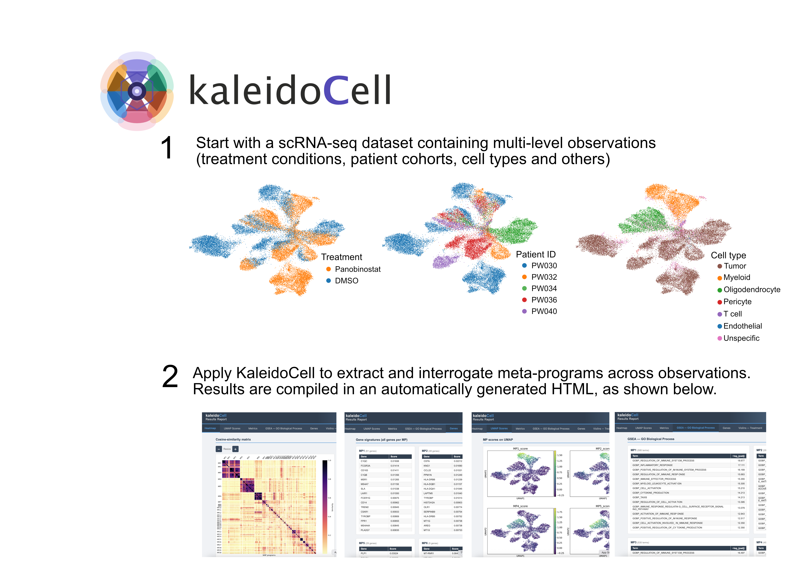

<p align="center">
  
</p>

<p align="center">
  <em>Scalable and interpretable identification of shared transcriptional programs<br>
  across single-cell cohorts</em>
</p>

<p align="center">
  
  
  
  
  
  
  
  
  <a href="https://www.biorxiv.org/content/10.64898/2026.05.13.724848v1.article-metrics">
    
  </a>
  <a href="https://kaleidocell.readthedocs.io/en/latest/index.html">
    
  </a>
</p>

---

KaleidoCell decomposes each sample in a cohort independently using NMF, then clusters
the resulting gene programs by cosine similarity across all samples and ranks to
derive **meta-programs (MPs)** — reproducible transcriptional signatures
shared across patients, conditions, or batches. KaleidoCell builds up on works like [cNMF](https://github.com/dylkot/cNMF) and [geneNMF](https://github.com/carmonalab/GeneNMF). 

Like looking through a kaleidoscope, what appears complex and noisy in individual samples
resolves into clear, recurring patterns at the cohort level.

---

## Material
|Folder | Description|
|------|---------|
|comparison| Files necessary to run the geneNMF vs. kaleidoCell runtime comparison|
|data| Mock data to run the example notebooks|
|examples| Example notebooks on how to use kaleidoCell|
|kaleidocell| Source code|

---

## Key features

- **GPU-accelerated NMF** via PyTorch — CUDA (Linux/HPC) and Apple MPS (M1/M2/M3) supported
- **Guided biologically relevant meta-programs derivation** with quality metrics per meta-program and integrated analysis/visualisation functions
- **GSEA** with bundled MSigDB gene sets (Hallmarks, GO BP/CC/MF, C6–C9)
- **Self-contained HTML report** with heatmap, UMAP, GSEA results, gene tables, and violin plots — no external dependencies to open it

---

## Graphical abstract

<p align="center">
  
</p>

## Installation

Usage of kaleidoCell on larger datasets (more than 10,000 cells) is not recommended on a personal computer, because of long runtime. We recommend using the tool on a high-performance computing machine.

### Via pip

```bash
pip install kaleidocell
```

### Using conda

```bash
# 1. Initialise conda (if not already active in your shell)
source "$(conda info --base)/etc/profile.d/conda.sh"

# 2. Set paths  (edit PROJECT_DIR to point at the kaleidocell folder inside your clone of this repo)
PROJECT_DIR=/path/to/KaleidoCell/kaleidocell
ENV_DIR=$PROJECT_DIR/.environments/kaleidocell_env

# 3. Create environment
conda create -n kaleidocell -p "$ENV_DIR" python=3.11 -y
conda activate kaleidocell

# 4.1 LINUX — Install GPU-enabled PyTorch
#     Run `nvidia-smi` to check your CUDA version.
#     cu124 → CUDA 12.4 | cu121 → CUDA 12.1 | cu118 → CUDA 11.8
pip install torch --index-url https://download.pytorch.org/whl/cu124

# 4.2 MAC — Install PyTorch with MPS (Metal Performance Shaders) support
#     No CUDA needed — GPU acceleration is provided natively via Apple Silicon.
pip install torch

# 5. Install KaleidoCell
cd "$PROJECT_DIR"
pip install -e .

# 6. Register a Jupyter kernel
pip install ipykernel
python -m ipykernel install --user \
    --name=kaleidocell_env \
    --display-name "KaleidoCell"
```

**To reactivate later:**

```bash
source "$(conda info --base)/etc/profile.d/conda.sh"
conda activate kaleidocell
```

**Verify GPU is visible:**

```python
import torch
print("CUDA available:", torch.cuda.is_available())   # → True
print("Device name:  ", torch.cuda.get_device_name())
```

---


### Other options: see documentation

For other installation possibilites, in particular for docker installation or usage on Mac, please follow the installation instructions in `KaleidoCell/kaleidocell/README.md`.

## Quick start

The minimal workflow runs in four steps.
A complete walkthrough with explanations is in [`examples/01_quickstart.ipynb`](examples/01_quickstart.ipynb). Other tutorials are also available in the same folder. 

```python
import kaleidocell
import scanpy as sc

# ── Load data ──────────────────────────────────────────────────────────────
# AnnData with log-normalised counts in .X
# adata.obs must contain a column identifying individual samples / patients
adata = sc.read_h5ad("../data/petersims_example.h5ad")
print(adata)
# AnnData object with n_obs × n_vars = 7 000 × 7 000
#     obs: 'Patients', 'Treatment', 'cell_type'

# ── Step 1 · Run NMF on every sample ──────────────────────────────────────
# KaleidoCell loops over each unique value in `batch_key`, extracts the
# corresponding cells, and runs NMF at each rank with multiple random starts.
results_nmf, convergence = kaleidocell.multi_sample_nmf(
    adata,
    batch_key="Patients",      # obs column identifying samples
    test_ranks=[4, 5, 6, 7, 8, 9],
    n_initializations=1,
    max_iterations=100,
)

# ── Step 2 · Derive consensus meta-programs ────────────────────────────────
# All W matrices are concatenated and clustered by cosine similarity.
# n_meta_programs is chosen automatically if not specified.
results_mp = kaleidocell.derive_nmf_metaprograms(results_nmf)

# Inspect quality metrics
print(results_mp["metrics"])
#        sampleCoverage  silhouette  meanSimilarity  nPrograms  nGenes
# MP1              1.00        0.61            0.82         12      50
# MP2              0.80        0.54            0.77          9      50
# ...

# ── Step 3 · Score cells by MP activity ───────────────────────────────────
# Returns a (n_cells × n_MPs) DataFrame of mean top-gene expression per cell.
mp_scores = kaleidocell.compute_mp_scores(results_mp, adata)

# ── Step 4 · Generate the HTML report ─────────────────────────────────────
# Produces a self-contained tabbed HTML file — open in any browser, no server needed.
path = kaleidocell.get_html(
    results_mp,
    adata,
    mp_scores=mp_scores,
    obs=["Treatment", "Patients"],   # obs keys → violin-plot tabs in the report
    output_path="results/",
)
print(f"Report written to: {path}")
# Report written to: results/results.html
```

### Visualise the similarity heatmap

```python
# Pairwise cosine-similarity matrix — tight diagonal blocks = well-separated MPs
kaleidocell.plot_heatmap(results_mp)
```

### Run GSEA on the meta-programs

```python
# Uses bundled MSigDB Hallmarks + GO Biological Process gene sets
results_gsea = kaleidocell.run_gsea_pipeline(
    results_mp,
    from_file=["h.all.v2026.1.Hs.symbols.gmt",
               "c5.go.bp.v2026.1.Hs.symbols.gmt"],
)
kaleidocell.plot_gsea_results(results_gsea)
```

---

## Output files

All files are written to the same directory as the HTML report.

| File | Description |
|------|-------------|
| `results.html` | Self-contained tabbed HTML report |
| `genes.csv` | Long-format gene table: `gene`, `mp`, `score` |
| `heatmap.pdf` | Cosine-similarity matrix of all NMF programs |
| `umap_scores.pdf` | MP activity scores projected on UMAP |
| `gsea_{label}.csv` | Significant GSEA terms per gene-set file |
| `gsea_{label}_{MP}.pdf` | GSEA bar plot per MP per gene-set file |
| `violins_{obs_key}.pdf` | MP score distributions per obs category |

---

## Bundled gene-set files

```python
print(kaleidocell.files)   # lists all bundled paths with descriptions
```

| File | Content |
|------|---------|
| `h.all.v2026.1.Hs.symbols.gmt` | MSigDB Hallmarks (50 gene sets) |
| `c5.go.bp.v2026.1.Hs.symbols.gmt` | GO Biological Process |
| `c5.go.cc.v2026.1.Hs.symbols.gmt` | GO Cellular Component |
| `c5.go.mf.v2026.1.Hs.symbols.gmt` | GO Molecular Function |
| `c6.all.v2026.1.Hs.symbols.gmt` | Oncogenic signatures |
| `c7.all.v2026.1.Hs.symbols.gmt` | Immunologic signatures |
| `c8.all.v2026.1.Hs.symbols.gmt` | Cell type signatures |
| `c9.all.v2026.1.Hs.symbols.gmt` | Cancer gene sets |
| `hgnc_ensembl_translation.txt` | Ensembl ↔ HGNC symbol mapping |

Short filenames are resolved automatically — no absolute path needed:

```python
kaleidocell.run_gsea_pipeline(results_mp, from_file=["h.all.v2026.1.Hs.symbols.gmt"])
```

---

## Documentation

For more information, see the [online documentation](https://kaleidocell.readthedocs.io/en/latest/index.html).

Build locally:

```bash
pip install sphinx pydata-sphinx-theme nbsphinx pandoc
cd docs && sphinx-build -b html . _build/html
# Open docs/_build/html/index.html in your browser
```

---

## Citation

If you use KaleidoCell in your research, please cite:

> Radig J., Welz C., Jerome M., Ostheimer P. S., Fellenz S., Radlwimmer B., Herrmann C. (2026). Identifying Treatment Related Signatures In Glioblastoma Using KaleidoCell.
> *bioRxiv*

[KaleidoCell preprint](https://www.biorxiv.org/content/10.64898/2026.05.13.724848v1.article-metrics)

---

## Authors

**Jean Radig** (<jean.radig@bioquant.uni-heidelberg.de>), **Carla Welz**  
cromLab · AG Herrmann · IPMB · BioQuant · Heidelberg University

## License

MIT
